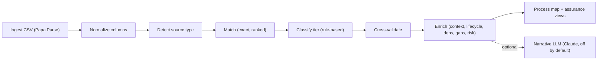
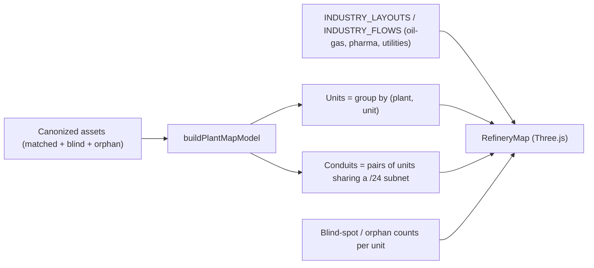

# Assurance Twin — OT Asset Reconciliation Methodology

**Audience:** NIST Operational Technology team
**Purpose:** Defensible, auditor-grade explanation of what the Assurance Twin does, how, and where the boundaries are. Use this as the speaker reference for the live demo.

---

## 1. Thesis (one paragraph)

The Assurance Twin is a **deterministic OT asset-reconciliation surface**. It ingests an **engineering baseline** (system-of-record as-designed) and an **OT discovery** export (as-found-on-network), normalizes both to a shared schema, **reconciles them by exact identifier matching**, classifies each asset by a transparent tier rule set, cross-validates the engineering and discovery views, and renders the result as a 62443-style **zone-and-conduit process map** with explicit **coverage**, **blind-spot**, and **orphan** counts. The pipeline is rule-based JavaScript with no ML or LLM in the canon path; an optional Anthropic Claude sidecar is available only for narrative engineering analysis and is off unless an API key is configured.

---

## 2. Architecture and stack reality

| Layer | Technology | Notes |
|-------|------------|-------|
| Client | React 18 + Vite | Single-page workspace (`src/AssuranceWorkspace.jsx`) |
| Pipeline (browser) | Plain JavaScript (deterministic) | `src/lib/context/*` |
| Pipeline (server mirror) | Node.js (ES modules) | `api/canonize.js` — same logic, server-side |
| Visualization | React, Three.js, react-simple-maps | `src/components/RefineryMap.jsx`, `WorldModel.jsx` |
| CSV parsing | Papa Parse | |
| Optional narrative AI | Anthropic Claude (`claude-sonnet-4-20250514`) | `api/analyze-engineering.js` — gated by `ANTHROPIC_API_KEY` |

**Truths to state out loud during the demo:**

- **No Python in production.** Python is not in the runtime, the build, or the deployment. There are no `.py` files in the application path.
- **No AI/ML/embeddings in the canon pipeline.** Matching, classification, validation, and the map are all deterministic rules. Same inputs → same outputs.
- **One LLM hook, one purpose.** The optional Claude call narrates engineering quality (`/api/analyze-engineering`). It does **not** influence matches, tiers, or coverage numbers.

---

## 3. Canonization pipeline

| Phase | Function | File | Lines |
|-------|----------|------|-------|
| Ingest | `Papa.parse` + provenance record | `src/AssuranceWorkspace.jsx` | `processData` |
| Normalize | `normalizeDataset` | `src/lib/context/constructor.js` | ~15–80 |
| Detect source type | `detectSourceType` | `src/lib/context/constructor.js` | ~97–132 |
| Match | `performMatching` | `src/lib/context/constructor.js` | 154–251 |
| Classify | `classifySecurityTier` | `src/lib/context/evaluator.js` | 16–65 |
| Validate | `crossValidate` | `src/lib/context/evaluator.js` | 71–118 |
| Review queue | `identifyReviewItems` | `src/lib/context/evaluator.js` | 133–180 |
| Enrich — device context | `addDeviceContext` | `src/lib/context/device-patterns.js` | |
| Enrich — lifecycle | `addLifecycleStatus` | `src/lib/context/lifecycle-tracker.js` | |
| Enrich — dependencies | `generateDependencyMap` | `src/lib/context/dependency-mapper.js` | |
| Enrich — gaps | `analyzeAllGaps` | `src/lib/context/gap-analyzer.js` | 383–423 |
| Enrich — risk | `analyzePortfolioRisk` | `src/lib/context/risk-engine.js` | |
| Visualize | `buildPlantMapModel` + `RefineryMap` | `src/lib/core/plant-map-model.js`, `src/components/RefineryMap.jsx` | |

---

## 4. Reconciliation methodology (the core)

We pair **engineering** rows to **discovery** rows using **four ranked exact-match strategies**. Each row is used at most once. There is no fuzzy matching.

| Rank | Strategy | Field | Confidence |
|------|----------|-------|-----------:|
| 1 | `exact_tag_id` | `tag_id` (exact) | 100 |
| 2 | `ip_match` | `ip_address` (exact) | 95 |
| 3 | `hostname_match` | `hostname` (case-insensitive) | 90 |
| 4 | `mac_match` | `mac_address` (exact) | 85 |

Source: `src/lib/context/constructor.js` lines 154–251.

After matching, three populations exist:

| Population | Definition |
|-----------|------------|
| **Matched** | Engineering row paired to a discovery row by one of the four strategies |
| **Blind spot** | Engineering row that was never matched (in baseline, not seen on network) |
| **Orphan** | Discovery row that was never matched (on network, not in baseline) |

### Denominators (used consistently across the UI after this release)

| Term | Set | Where it shows up |
|------|-----|-------------------|
| `documented` | matched + blind spots (engineering baseline) | "Documented Assets" card, Security Posture Q1 |
| `discovered` | matched + orphans (anything seen on network) | "Discovered Assets" reference |
| `inScope` | matched + blind spots + orphans (union) | Map "In-scope Assets" card |
| `discoveryCoverage` | matched / documented | "Discovery Coverage" card and map strip |

### Cross-validation (post-match)

`crossValidate` (`src/lib/context/evaluator.js` lines 71–118) counts agreement across **five fields**: `tag_id`, `ip_address`, `hostname`, `device_type` (substring heuristic on first 4 chars), `manufacturer`. Threshold:

- **HIGH** — ≥ 3 fields agree
- **MEDIUM** — 1–2 agree
- **LOW** — 0 agree

This is the "confidence" badge shown next to the asset reconciliation status in the table. We label it **Matched (high/medium/low)** rather than "Verified" — the latter is a control-test verb we deliberately avoid.

---

## 5. Classification methodology

Tiering is rule-based on `device_type` and presence of `ip_address` or `mac_address`. Source: `src/lib/context/evaluator.js` lines 16–65.

| Tier | Label | Rule | Mapping |
|------|-------|------|---------|
| 1 | Critical Network Asset | `device_type` matches keywords: PLC, DCS, HMI, SCADA, RTU, controller, server, workstation, historian, safety, switch, router, firewall, gateway | Purdue L1–L3 / 62443 critical zones |
| 2 | Networkable Device | Has IP or MAC, OR `device_type` matches: smart, ip, ethernet, profinet, modbus/tcp, camera, analyzer, vfd, drive, inverter | Purdue L1–L2 networked field devices |
| 3 | Passive / Analog | Default — no IP, no MAC, not in tier-1/2 keyword sets | Inventory only |

**Stated explicitly:** This is a **transparent rule set**, not ISA-95 itself. ISA-95 is the conceptual frame; the tier rules are how we operationalize it given a row of CSV.

---

## 6. Process map construction

The bottom map is a **hybrid**: industry-template flow plus data-derived units and conduits.

| Aspect | How it's built | File |
|--------|----------------|------|
| Units | Group canonized assets by `plant` + `unit` | `src/lib/core/plant-map-model.js` |
| Asset counts per unit | `pushAsset` aggregates matched/blind/orphan and tier 1/2/3 | `src/lib/core/plant-map-model.js` |
| Conduits (zone connectivity) | Pairs of units that share at least one IPv4 `/24` prefix | `buildNetworkConduits` |
| Conduit strength | `min(1, sharedSubnetCount * 0.25)` — used only for line opacity, not assurance | `plant-map-model.js` |
| Process flow lines | From hardcoded `INDUSTRY_FLOWS` template, drawn only when both endpoint units exist in the data | `src/components/RefineryMap.jsx` |
| Layout positions | Hardcoded `INDUSTRY_LAYOUTS` template + seeded jitter; unknown units placed on a spiral fallback | `src/components/RefineryMap.jsx` |
| Gap badges on the map | Per-unit blind-spot / orphan counts plus optional `gapMatrix` from `analyzeAllGaps` | `src/components/RefineryMap.jsx` |

---

## 7. Framework alignment

We map the surface to three NIST/ISA references that NIST OT auditors expect:

### NIST CSF v2.0

| CSF Subcategory | Where in the Twin |
|-----------------|--------------------|
| **ID.AM-01** Inventories of physical devices and systems | "Documented Assets" card, Asset Table, blind-spot list |
| **ID.AM-02** Software/firmware inventories | Firmware fields in Asset Detail (where present in discovery export) |
| **ID.AM-03** Comms / data flows mapped | Process Map conduits and protocols panel |
| **ID.AM-04** External information systems | Orphan list (devices on network not in baseline) |
| **ID.RA-01..06** Risk identification | Gap panel, Portfolio Risk (`risk-engine.js`) |
| **PR.AA / PR.IR** Identity, access, network resilience | Tier 1–2 Managed coverage, segmentation gap callouts |
| **DE.CM** Continuous monitoring | Discovery Coverage trend, last-seen dates |

### NIST SP 800-82r3 (Guide to OT Security)

| 800-82r3 section | Where in the Twin |
|-------------------|-------------------|
| §5.1 Asset inventory | Documented + Discovered + In-scope counts |
| §5.2 Network architecture / Purdue | Tier 1/2/3 classification, process map zones |
| §5.3 Risk-based zoning | Conduits between units (62443-style), gap overlay |
| §6 Risk management | Gap and risk panels |
| §A controls catalog | Cross-referenced where engineering data carries control identifiers |

**Plain-language stance:** the Twin is **input** to an OT security program. It does not replace 800-82r3 risk assessment; it gives the assessor a defensible, evidence-traceable inventory and gap baseline to feed into one.

### ISA / IEC 62443

| Standard | Where in the Twin |
|----------|-------------------|
| **62443-2-1** Security program elements | Demonstrates inventory + asset categorization required by §4.2.3 |
| **62443-3-2** Zone and conduit identification | Process map shows units (zones) and shared-subnet inferences (conduits). Stated as **inferences from network evidence**, not authoritative zoning. |
| **62443-3-3** System security requirements (SR) | Referenced in `compliance-mapper.js` and in the gap layer where SR identifiers are mapped to observed evidence |
| **IEC 61511** Safety instrumented systems | Tier 1 critical assets flagged where `device_type` or tag indicates SIS / safety |

---

## 8. Heuristics and known limits (auditor-honest section)

Stated up front so questions don't surprise us:

- **Confidence values are fixed per strategy** (100/95/90/85). They are **strategy ranks**, not Bayesian posteriors. We do not claim a probabilistic interpretation.
- **Conduit inference is `/24`-based.** Networks using `/16` aggregations or NAT will under-report or over-report shared zones. Stated in the map footnote.
- **Conduit `strength` formula** (`subnets * 0.25`, capped at 1) is for **line opacity only**. It is not an assurance metric and we do not present it as one.
- **Process map layout uses seeded jitter.** Same input renders the same way each load, but the absolute positions are visual aids — they are **not** physical plot plans.
- **`netlify/functions/analyze.js`** contains a legacy "force matching to 50–75%" demo block. The browser demo loader (`AssuranceWorkspace.jsx → loadDemo → processData`) does **not** call this path. We do not show that endpoint during the NIST demo.
- **Automotive sample uses real Toyota site names** as plant labels in the synthetic data. Acknowledge if asked: it is a synthetic demonstration dataset, not customer data.
- **`WorldModel` (Sites overlay)** mixes static metadata with data-derived sites. Coordinates fall back to a small set of US cities when the dataset has unknown plants. Show only on datasets where we trust the labels.
- **Tier classification is keyword-based.** If a customer's `device_type` vocabulary differs from the keyword set, we add their vocabulary to the rule set — not the model. This is a feature, not a bug: the rules are auditable.

---

## 9. Demo flow (10 minutes)

| Min | What you do | What you say |
|----:|-------------|--------------|
| 0:00 | Open the workspace, no data loaded | "What you're going to see is a deterministic OT asset reconciliation surface. No Python, no ML in the canon path. Everything is rule-based and auditable." |
| 0:30 | Select **Oil & Gas - Medium** demo, click **Load Demo** | "I'm loading a synthetic refinery: an engineering baseline and an OT discovery export — same shape a customer would hand us." |
| 1:00 | Point at the assembly status bar moving through phases | "Five phases: ingest, reconcile, map, verify, enrich. We can show the code for each." |
| 1:30 | Point at the three top cards: Documented Assets / Discovery Coverage / Tier 1–2 Managed | "Three named denominators. Documented = engineering baseline. Discovery Coverage = matched over documented. Tier 1–2 Managed = managed networkable assets over total networkable. Same numbers everywhere they appear." |
| 2:30 | Process Map view — point at a unit | "These are the zones — your refinery process units. Conduits are inferred from shared `/24` subnets. We are explicit that this is an inference from network evidence, not an authoritative 62443 zoning." |
| 3:30 | Click a unit | "Unit summary: counts, tier mix, blind spots. From here I can drill into a single asset." |
| 4:30 | Open a **blind spot** in the asset table | "Blind spot: in the engineering baseline, not seen on the network. Here is the engineering record we have. Here is what discovery is missing. This is your ID.AM-01 evidence trail." |
| 5:30 | Open an **orphan** | "Orphan: discovered on the network, not in the baseline. This is your ID.AM-04 / shadow IT signal." |
| 6:30 | Switch to the **Security** tab | "Security Posture answers four assurance questions, each tied back to the same canonical numbers: documented, discovered, in-scope, coverage." |
| 7:30 | Switch to the **Gaps** tab | "Gap analysis is rule-based against unit knowledge expectations and the canonized result. Severity is text-tagged, not heuristic." |
| 8:30 | Switch to the **Sites** overlay (only if dataset has trusted labels) | "Enterprise view across plants. We show only what we can ground in the data." |
| 9:30 | Close out | "What you saw was deterministic. Same CSV in, same output every time. The optional Claude narrative panel exists but was not used to compute any of these numbers." |

---

## 10. FAQ

**Is this AI?**
The reconciliation pipeline is not AI. It is rule-based JavaScript. There is one optional Anthropic Claude call that produces narrative engineering analysis. It is gated by an API key, off by default, and does not feed into matching, classification, validation, coverage, or the map.

**Where is Python?**
There is no Python in the application path. The pipeline is React + Node JavaScript. We can show `package.json` if asked.

**What if my IP allocation is `/16` instead of `/24`?**
The conduit inference is currently `/24`-based and will under-cluster. We treat this as a configurable rule. The asset-level data is unaffected; only the conduit visualization is affected.

**How do you handle false matches?**
Each match has a **strategy rank** (100/95/90/85) and a separate **cross-validation confidence** (HIGH/MEDIUM/LOW based on agreement count across five fields). Low-confidence matches and Tier-3 assets that appear on the network are routed to the `identifyReviewItems` queue surfaced in the workspace.

**Where does 62443 zoning come from?**
We do not generate zoning. We **infer** zone candidates from network evidence (`/24` co-residency) and let the assessor confirm against engineering ground truth. This is stated on the map and in this brief.

**Can this hit my production environment?**
The Twin reads CSVs that the customer provides. It does not call back into a customer network. The demo runs entirely in-browser.

**What if a customer challenges the keyword list for tiering?**
The list is in `src/lib/context/evaluator.js`, lines 16–65. It is auditable and configurable per engagement. We do not hide it.

**Why is "matched" 100 confident?**
Because by definition `exact_tag_id` is a deterministic identifier match on a customer-provided unique identifier. The 100 reflects **strategy rank**, not certainty about the underlying ground truth — we still cross-validate the matched record against five independent fields, and we expose the cross-validation confidence (HIGH/MEDIUM/LOW) in the asset detail view.

---

## 11. References (code anchors for Q&A)

| Topic | File | Lines |
|-------|------|------:|
| Match strategies | `src/lib/context/constructor.js` | 154–251 |
| Tier rules | `src/lib/context/evaluator.js` | 16–65 |
| Cross-validation | `src/lib/context/evaluator.js` | 71–118 |
| Review queue | `src/lib/context/evaluator.js` | 133–180 |
| Plant/Unit aggregation | `src/lib/core/plant-map-model.js` | 130–208 |
| Conduit inference | `src/lib/core/plant-map-model.js` | 84–128 |
| Process map render | `src/components/RefineryMap.jsx` | full |
| Optional narrative AI | `api/analyze-engineering.js`, `src/lib/context/engineering-analyzer.js` | full |

---

## Appendix A. Verified demo numbers (captured during build)

These are the live values from the harmonized UI on the synthetic demo data. Use them to confirm the pitch matches the screen during the live demo.

### Oil & Gas — Medium (`samples/demo/oil-gas`)

| Metric | Value | Reads |
|--------|------:|-------|
| Documented assets | 12,000 | 8,400 matched + 3,600 blind |
| Discovered assets | 8,800 | 8,400 matched + 400 orphans |
| In-scope assets | 12,400 | union of documented and discovered |
| Discovery Coverage | 70% | matched / documented |
| Tier 1–2 Managed | 4,634 / 11,009 | 6,375 unmanaged · 5,173 with CVEs |
| 62443-style conduits | 78 | inferred from shared /24 subnets |

Reconciliation check: 8,400 + 3,600 = 12,000 documented. 8,400 + 400 = 8,800 discovered. 12,000 + 400 = 12,400 in-scope. 8,400 / 12,000 = 70%.

### Pharma — Large (`samples/aigne/pharma/large`)

| Metric | Value | Reads |
|--------|------:|-------|
| Documented assets | 11,032 | 7,811 matched + 3,221 blind |
| Discovered assets | 9,595 | 7,811 matched + 1,784 orphans |
| In-scope assets | 12,816 | union of documented and discovered |
| Discovery Coverage | 71% | matched / documented |
| Tier 1–2 Managed | 2,548 / 5,285 | 2,737 unmanaged |
| 62443-style conduits | 24 | inferred from shared /24 subnets |
| Sites observed | 3 | All Sites selector populated from data |

Reconciliation check: 7,811 + 3,221 = 11,032 documented. 7,811 + 1,784 = 9,595 discovered. 11,032 + 1,784 = 12,816 in-scope. 7,811 / 11,032 ≈ 71%.

## Appendix B. Screenshots

Located under `docs/demo/screenshots/`:

- `01-process-map.png` — Oil & Gas medium, Process Map view, harmonized denominators in the top bar and map evidence strip.
- `02-asset-table.png` — Asset Table tab in the right panel with the new `RECONCILIATION` column and filter chips.
- `03-security-posture.png` — Security Posture with the four NIST/62443-aligned questions.
- `04-pharma-demo.png` — Pharma demo showing the same canonical denominators across a different industry template.
